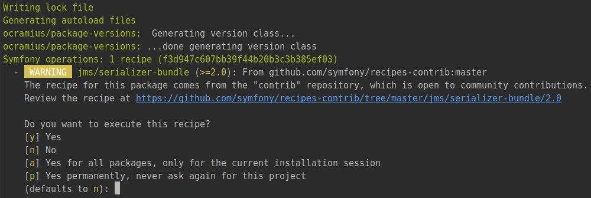

# Jobeet Day 12: The API

When you post a job, you will want to have the greatest exposure possible.
If your job is syndicated on a lot of small sites, you will have a better chance to find the right person. That’s the power of the [long tail][1].
Affiliates will be able to publish the latest posted jobs on their sites thanks to the API we will develop along this day.

## Affiliates

As per [day 2](day-2.md) requirements:

> "Story F7: An affiliate retrieves the current active job list"

### The Fixtures

> Note! There was a change in day 3: in file `src/Entity/Affiliate.php` method `setCategories` was replaced by two methods
> `addCategory` and `removeCategory`. Please check if you have these methods in Affiliate class and compare it with file from [day 3](day-3.md).

Let’s create a new fixture file for the affiliates:

```php
namespace App\DataFixtures;

use App\Entity\Affiliate;
use Doctrine\Bundle\FixturesBundle\Fixture;
use Doctrine\Common\DataFixtures\OrderedFixtureInterface;
use Doctrine\Common\Persistence\ObjectManager;

class AffiliateFixtures extends Fixture implements OrderedFixtureInterface
{
    /**
     * @param ObjectManager $manager
     *
     * @return void
     */
    public function load(ObjectManager $manager) : void
    {
        $affiliateSensioLabs = new Affiliate();
        $affiliateSensioLabs->setUrl('http://www.sensiolabs.com/');
        $affiliateSensioLabs->setEmail('contact@sensiolabs.com');
        $affiliateSensioLabs->setActive(true);
        $affiliateSensioLabs->setToken('sensio_labs');
        $affiliateSensioLabs->addCategory($manager->merge($this->getReference('category-programming')));

        $affiliateKNPLabs = new Affiliate();
        $affiliateKNPLabs->setUrl('http://www.knplabs.com/');
        $affiliateKNPLabs->setEmail('hello@knplabs.com');
        $affiliateKNPLabs->setActive(true);
        $affiliateKNPLabs->setToken('knp_labs');
        $affiliateKNPLabs->addCategory($manager->merge($this->getReference('category-programming')));
        $affiliateKNPLabs->addCategory($manager->merge($this->getReference('category-design')));

        $manager->persist($affiliateSensioLabs);
        $manager->persist($affiliateKNPLabs);

        $manager->flush();
    }

    /**
     * @return int
     */
    public function getOrder() : int
    {
        return 3;
    }
}
```

In the fixtures file, tokens are hardcoded to simplify the testing, but when an actual user applies for an account, the token will need to be generated.
Create a new listener in `src/EventListener` folder:

```php
namespace App\EventListener;

use App\Entity\Affiliate;
use Doctrine\ORM\Event\LifecycleEventArgs;

class AffiliateTokenListener
{
    /**
     * @param LifecycleEventArgs $args
     */
    public function prePersist(LifecycleEventArgs $args)
    {
        $entity = $args->getEntity();

        if (!$entity instanceof Affiliate) {
            return;
        }

        if (!$entity->getToken()) {
            $entity->setToken(\bin2hex(\random_bytes(10)));
        }
    }
}
```

Register this listener in `config/services.yaml`:

```yaml
# ...

services:
    # ...
    
    App\EventListener\AffiliateTokenListener:
        tags:
            - { name: doctrine.event_listener, event: prePersist }
```

Now you can reload fixtures:

```bash
bin/console doctrine:fixtures:load
```

## The Job API

To create the job API we gonna use bunch of two bundles: [JMSSerializerBundle][3] and [FOSRestBundle][2].
**JMSSerializerBundle** is used to easily serialize and deserialize data, and **FOSRestBundle** provides various tools to rapidly develop RESTful API’s.

First install [JMSSerializerBundle][3]:

```bash
composer require jms/serializer-bundle ^2.4
```

During the installation you will be asked if recipe from **contrib** repository should be applied:



Our suggestion is to answer `y` *(Yes)*.  
Thanks to Symfony Flex and this recipe bundle will be automatically connected in `config/bundles.php` and next configuration files will be created:

* `config/packages/dev/jms_serializer.yaml`
* `config/packages/jms_serializer.yaml`

Next install [FOSRestBundle][2]:

```bash
composer require friendsofsymfony/rest-bundle ^2.3
```

There will be the same question and after that new config file will appear: `config/packages/fos_rest.yaml`.  
We have bundles installed and initial configuration created!

## The Affiliate Application Form

*Work in progress*

## Additional information

*Work in progress*

## The Affiliate CRUD for Admin

*Work in progress*

## Next Steps

Continue this tutorial here: Jobeet Day 13: The Mailer

Previous post is available here: [Jobeet Day 11: The User](day-11.md)

Main page is available here: [Symfony 4.1 Jobeet Tutorial](../index.md)

[1]: https://en.wikipedia.org/wiki/Long_tail
[2]: https://symfony.com/doc/1.5/bundles/FOSRestBundle/index.html
[3]: https://github.com/schmittjoh/JMSSerializerBundle
